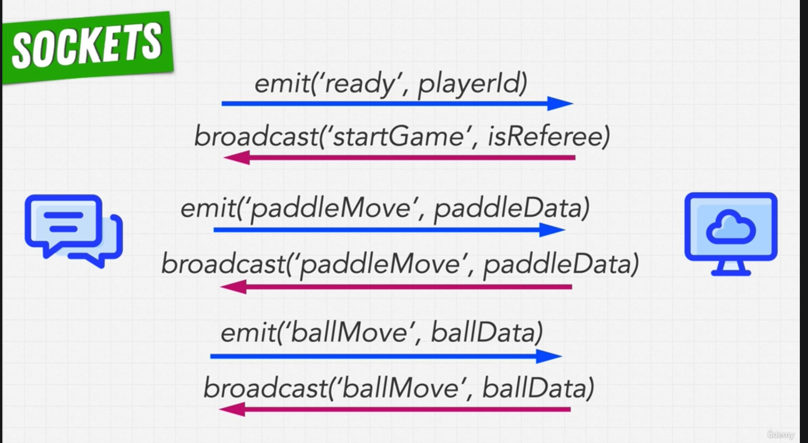

# nodejs-socket-pong-game

This repository contains a multiplayer Pong game implemented in Node.js using Socket.io. This application provides an excellent demonstration of how real-time bidirectional event-based communication can be facilitated using Socket.io.



Socket.io is a JavaScript library that enables real-time, bidirectional and event-based communication between the browser and the server. More about Socket.io can be found [here](https://socket.io/).

## Getting Started

Follow these instructions to get the Pong game up and running on your local machine for development and testing purposes.

### Prerequisites

- Node.js and npm installed. If not, download them from [here](https://nodejs.org/en/download/).
- Basic understanding of JavaScript and Node.js

### Installation

1. Clone this repository

   ```
   git clone https://github.com/username/nodejs-socket-pong-game.git
   ```

2. Navigate to the repository folder

   ```
   cd nodejs-socket-pong-game
   ```

3. Install the dependencies
   ```
   npm install
   ```

## Usage

1. Start the server

   ```
   npm start
   ```

2. Open your browser and visit `http://localhost:3000`

3. Enjoy the game!

## Contributing

Pull requests are welcome. For major changes, please open an issue first to discuss what you would like to change.

Please make sure to update tests as appropriate.

## License

This project is licensed under the MIT License - see the [LICENSE](LICENSE) file for details.

## References

- [Socket.io](https://socket.io/) for providing the library for real-time web applications.
